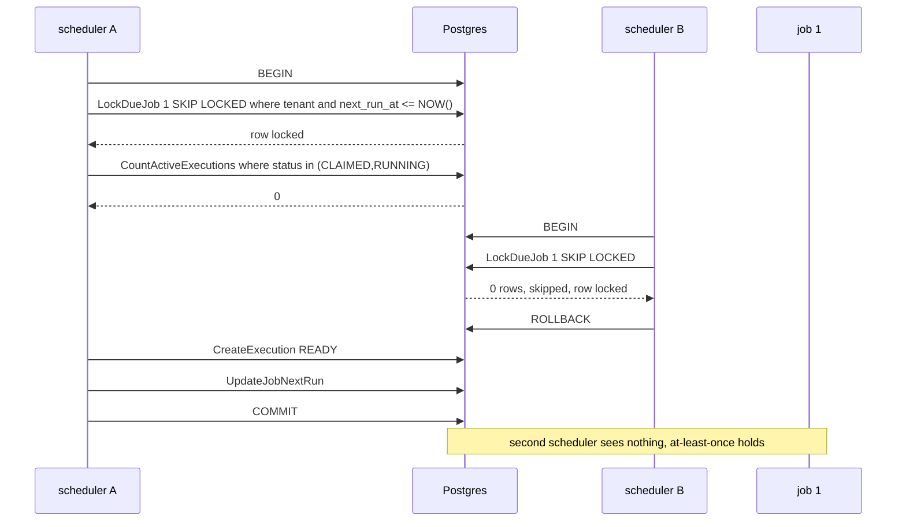
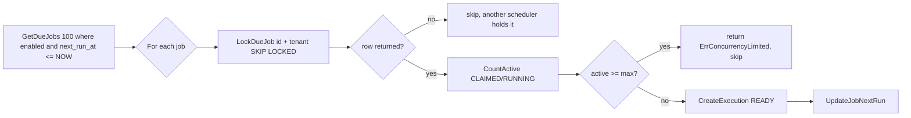
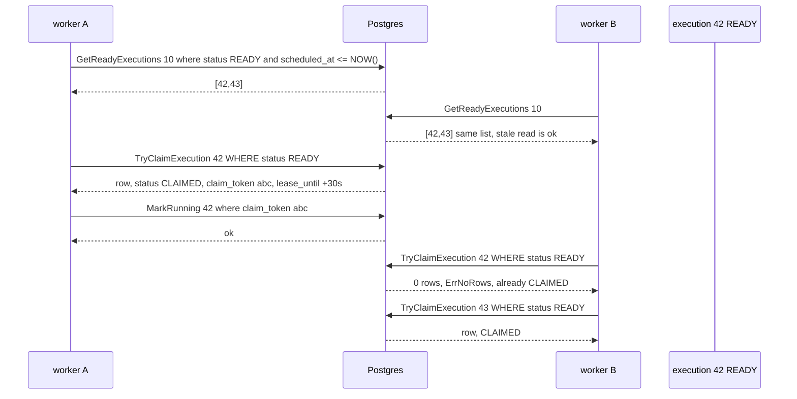
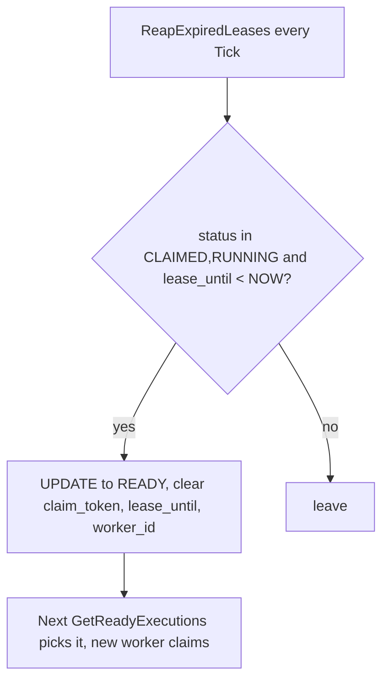
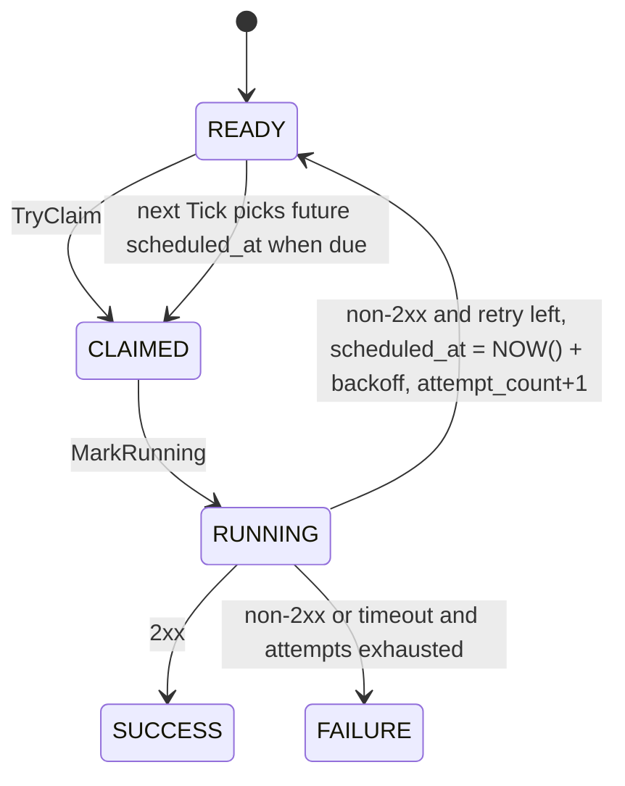

# Architecture

Cronio keeps the database as the source of truth. Schedulers find due jobs and create executions. Workers claim executions and call your HTTP endpoint. The API creates jobs. Each part scales on its own.

## System overview

All three services use the same Postgres and the same deep `job` seam. For MVP they run in one binary `server/cmd/api/main.go:22`. Later they split to `cmd/api`, `cmd/scheduler`, `cmd/worker` with no code change beyond wiring.

```
                    API call
                       |
                       v
                 +-----------+
                 |   API     |  POST /v1/jobs, PATCH, GET, tenant header
                 |  chi      |
                 +-----+-----+
                       |  writes jobs row with next_run_at
                       v
                 +-----+-----+
                 | Postgres  |  source of truth
                 |  jobs     |  executions  attempts
                 +--+--+-----+
                    ^  ^
                    |  |
        polls every 1s  |  polls every 1s
                    |  |
         +----------+  +----------+
         | Scheduler |  |  Worker  |
         | ticker    |  |  fleet   |
         +-----+-----+  +-----+----+
               |              |  claim READY, POST target_url
               |              v
               |        +-----+-----+
               |        |  Your URL |  https://example.com/hook
               |        +-----------+
               v
        creates READY execution
        and advances next_run_at
```

Control plane is API, scheduler, worker. Data plane is Postgres and your HTTP targets. NATS and dispatcher are planned for Phase 1.5, not in MVP.

## Modules and seams

We use deep modules: a small interface that hides a lot of behavior. One interface, many call sites. Bugs and changes stay behind the seam.

### The deep Job module

Location: `server/internal/job/`

It owns the Job seam and everything behind it. Callers learn three constructors and a few methods. They never import `database/sql` or `cron`.

* `schedule.go` — `Schedule`. Build it with `NewCronSchedule`, `NewIntervalSchedule`, `NewOnceSchedule`. Validation happens at construction, not on every tick. `NextRun(from)` is pure and returns UTC. Cron is 5-field plus `time.LoadLocation`, interval is `time.ParseDuration` greater than zero, once is `time.RFC3339` that disables when past.
* `tenant.go` — `TenantID uuid.UUID` as a distinct type. It forces callers to pass a tenant and prevents swapping `jobID` and `tenantID`.
* `service.go` — `ScheduleDue(ctx, TenantID, jobID)`. One transaction: `LockDueJob FOR UPDATE SKIP LOCKED` tenant-scoped, `CountActiveExecutions` for `concurrency_max_executions`, typed `Schedule` rebuild and `NextRun` after the due time, `CreateExecution` with `scheduled_at` equal to the due time, `UpdateJobNextRun` with `enabled=false` for a finished Once. Fleet safe, at-least-once, no caller glue.
* `store.go` — `Create` and `Update` and `Get` and `List`. They validate `name`, `target_url`, and presence of a schedule, compute `next_run_at` from `Schedule.NextRun(time.Now())`, and hide `sql.NullTime` and `sql.NullString`.

The old shallow cluster `internal/scheduler/`, `internal/database/repository/`, `internal/jobs/`, `internal/schedular/` existed to make testing easy but pushed bugs to callers. Deleting them made locality better.

### HTTP plane

Location: `server/internal/server/` and `server/internal/server/middleware/`

Chi router with four middlewares in order `RequestID -> Recovery -> Logger -> Timeout(10s)` plus `server` timeouts `ReadHeader 5s/Read 10s/Write 30s`. `GET /health` is open. `/v1` is protected by `Tenant` middleware that reads `X-Tenant-ID` and validates UUID. Handlers in `server.go` are thin mappers: JSON -> typed `Schedule` -> `job.Service` -> JSON and status codes. All schedule parsing lives in the Job module, not in the handler.

### Config and wiring

`server/internal/config/config.go` reads `DB_URL` required and `PORT` and `LOG_LEVEL` with defaults. `server/cmd/api/main.go` loads `server/.env` via `godotenv` when run from `server/`, connects with `database.New` which pings with 5 seconds, runs migrations from the embedded `migrations/*.sql` via `golang-migrate` on a throwaway connection so the main pool stays open, then creates `job.New(db)`, `server.New(port, logger, db)`, `scheduler.NewTicker` and `worker.New` both running in-process for MVP. They will split to `cmd/scheduler` and `cmd/worker` for independent scaling with no code change beyond wiring.

## How a job fires

One timeline, from create to success. Numbers are actual DB rows.

```
time ->

API:   POST /v1/jobs  --->  jobs row: enabled=true, next_run_at=2026-08-31T12:00:31Z
                               |
scheduler tick 1s:             |  GetDueJobs where enabled and next_run_at <= NOW()
                               v
                        LockDueJob FOR UPDATE SKIP LOCKED
                        CountActiveExecutions where status in (CLAIMED,RUNNING)
                        CreateExecution status=READY, scheduled_at=12:00:31
                        UpdateJobNextRun next_run_at=12:00:41
                               |
worker tick 1s:                |  GetReadyExecutions where status=READY and scheduled_at <= NOW()
                               v
                        TryClaimExecution set status=CLAIMED, claim_token, lease_until 30s, worker_id
                        MarkRunning set status=RUNNING
                        CreateAttempt attempt_number 1, status RUNNING
                        doHTTP POST target_url with timeout 30s
                               |
                        target returns 200
                               |
                        CompleteAttempt status SUCCESS, response 200
                        CompleteExecutionSuccess status SUCCESS, result 200
                               |
API:   GET /v1/jobs/{id}/executions  --->  [{status: SUCCESS, scheduled_at: 12:00:31}]
```

If target returns 500 or times out, worker does not mark SUCCESS. It writes the attempt as FAILURE or TIMEOUT, then either reschedules the same execution to READY with `scheduled_at = NOW() + backoff` or marks FAILURE terminal when `attempt_count >= retry_max_attempts`.

## Database

Postgres 15+ with `pgcrypto` for `gen_random_uuid()`.

* `jobs` — the card on the wall: `tenant_id`, `name`, `schedule_type` check `cron|interval|once`, `schedule_expr`, `timezone default UTC`, `target_*`, `retry_*`, `concurrency_max_executions default 1`, `misfire_policy default fire_once`, `enabled`, `next_run_at timestamptz` with partial index `idx_jobs_next_run where enabled=true`, `metadata jsonb`.
* `executions` — one chit per firing: `job_id -> jobs`, `tenant_id`, `status` `READY|CLAIMED|RUNNING|SUCCESS|FAILURE|TIMEOUT|CANCELLED|DEAD`, `scheduled_at`, `claimed_at`, `lease_until`, `claim_token`, `attempt_count`, `result_*`. Indexes on `status = READY and scheduled_at` and `lease_until where status in (CLAIMED,RUNNING)`.
* `attempts` — one try within an execution: `execution_id -> executions`, `attempt_number` unique per execution, `status` `RUNNING|SUCCESS|FAILURE|TIMEOUT`, request and response bodies and headers. Worker writes one row per try.

Tables and indexes:

```
jobs 1---* executions 1---* attempts
 |           |
 |           +-- idx_jobs_next_run (next_run_at) where enabled
 |           +-- idx_executions_ready (status, scheduled_at) where READY
 |           +-- idx_executions_lease (lease_until) where CLAIMED,RUNNING
 |
 +-- tenant_id, schedule_type, target_url, retry_* ...

jobs.next_run_at is the only scheduler cursor
executions.scheduled_at is the only worker cursor
executions.claim_token + lease_until is the lease
```

Generated code in `server/internal/database/generated/` is committed. Edit `queries/*.sql` then `sqlc generate`. Do not hand edit. `worker.sql` holds `GetReadyExecutions` with `scheduled_at <= NOW()` and `TryClaimExecution` with `gen_random_uuid()` and 30s lease, `scheduler.sql` holds `LockDueJob SKIP LOCKED`.

## Execution lifecycle

States move in one direction, except retry which loops READY.

```
jobs row:
  enabled=true, next_run_at set  ---->  scheduler Tick  ---->  next_run_at advanced, or enabled=false for finished Once

executions:
  READY --TryClaim--> CLAIMED --MarkRunning--> RUNNING --2xx--> SUCCESS (terminal)
    |                                      |
    +--non-2xx and retry left--> READY (rescheduled with backoff, attempt_count+1, scheduled_at future)
    |                                      |
    +--non-2xx and exhausted----> FAILURE (terminal)
    |
    +--timeout------------------> TIMEOUT attempt then READY or FAILURE as above

attempts per execution:
  RUNNING -> SUCCESS or FAILURE or TIMEOUT, one row per try, attempt_number 1,2,3
```

Worker writes both the attempt and the execution update. Scheduler never writes attempts. This keeps the seam clean.

## Transactions

`ScheduleDue` is the only place that writes both `executions` and `jobs.next_run_at` together. It holds the row lock for less than a millisecond, then releases. Workers hold the lease for seconds via `TryClaimExecution` and `MarkRunning` then `lease_until` 30s. `ScheduleDue` and worker claim are separate transactions, both `SKIP LOCKED`, so schedulers and workers scale separately.

Sequence, two schedulers racing for the same due job:

```
scheduler A                  Postgres                  scheduler B
    |  BEGIN                    |                         |
    |  LockDueJob 1 SKIP LOCKED |                         |
    |-------------------------->|  row locked               |
    |                           |                         |  LockDueJob 1 SKIP LOCKED
    |                           |<------------------------|  returns 0 rows, SKIP LOCKED skips locked row
    |  CountActiveExecutions    |                         |  returns, does nothing
    |  CreateExecution READY    |                         |
    |  UpdateJobNextRun         |                         |
    |  COMMIT                   |                         |
    |<--------------------------|                         |
```

Same idea for workers racing for READY:

```
worker A                     Postgres                   worker B
    |  GetReadyExecutions 10    |                        |
    |<--------------------------|  returns [exec 1,2]     |
    |  TryClaim exec1 READY     |                        |  GetReadyExecutions 10
    |  succeeds, status CLAIMED |                        |  also sees exec1 READY in list
    |                           |                        |  TryClaim exec1 READY
    |                           |                        |  fails, WHERE status=READY matches 0 rows, returns ErrNoRows
    |  MarkRunning, doHTTP      |                        |  skips, tries exec2
```

Reap runs at the start of every worker Tick and resets any `CLAIMED` or `RUNNING` where `lease_until < NOW()` back to `READY`. That is how a dead worker releases its claim.

## Concurrency, races, and how we handle them

This is the core of Cronio. Every race is decided by Postgres, not by in-memory locks.

### Scheduler concurrency: one job, many schedulers, one execution

`concurrency_max_executions` is 1 by default. Scheduler checks it inside the same `LockDueJob` transaction, so the check and the create are atomic.



Tenant isolation is in the lock: `WHERE id = $1 AND tenant_id = $2`. A wrong tenant never locks the row.



### Worker concurrency: many workers, one READY, one claim

Worker has no long transaction. It uses an atomic `UPDATE WHERE status=READY` to claim. Only one worker gets the row.



Lease protects against a dead worker between `CLAIMED` and `RUNNING` finishing the HTTP call. No heartbeat yet for MVP, but the 30s lease is enough because `doHTTP` timeout is 30s. If the worker dies, `ReapExpiredLeases` runs at the start of every Tick:



### Per-job concurrency vs global concurrency

Scheduler checks per-job active executions. Workers do not check per-job, they just claim whatever is READY. This split is intentional: scheduler holds the row for less than 1ms, worker holds the lease for seconds. If we checked concurrency in worker, we would need to hold a lock for seconds and kill throughput.

Current table for a job with `concurrency_max_executions = 2`:

```
time 0: job next_run_at due, scheduler creates exec 1 READY
time 1: scheduler creates exec 2 READY, CountActive is 0, both READY
time 2: worker claims exec 1, status CLAIMED, CountActive 1
time 3: worker claims exec 2, status CLAIMED, CountActive 2
time 4: scheduler tries to create exec 3, CountActive 2 >= max 2, returns limited, skips
time 30: worker finishes exec 1 SUCCESS, CountActive drops to 1, scheduler can create again
```

### Retry race: one execution, many attempts

Retry does not create a new execution. It re-queues the same row. That avoids a race where scheduler advances `next_run_at` and worker creates a new execution at the same time.



No new `jobs.next_run_at` is written on retry. That keeps the scheduler cursor clean.

## Scaling and failure

Run one API and two schedulers and two workers in one binary for MVP, or split to `cmd/api`, `cmd/scheduler`, `cmd/worker` later with same DB pool. Both schedulers poll `GetDueJobs` every second, `SKIP LOCKED` gives different rows. Workers poll `GetReadyExecutions` every second where `scheduled_at <= NOW()`, claim with `status READY` check. Kill a scheduler, the other picks up within a tick. Kill a worker holding `CLAIMED`, its `lease_until` expires after 30 seconds and `ReapExpiredLeases` resets it to `READY` so another worker claims it. Retries use exponential backoff in `worker.NextDelay`, capped at `retry_max_delay_seconds`.

Failure modes and what you see:

```
scheduler down 2 minutes, jobs due    ->  jobs stay READY with past next_run_at, when scheduler returns it creates one READY per overdue job (fire_once), not a backlog per missed tick
worker down, execution CLAIMED        ->  lease expires, reaped to READY, another worker retries, attempts keep history so you see the gap
target 500 three times                ->  three attempts, delays 60s, 120s, then execution FAILURE terminal, job keeps enabled and next_run_at still advances
target timeout                        ->  attempt TIMEOUT, same retry logic, result_error holds context deadline text
concurrency max 1, job takes 40s      ->  scheduler sees CountActive 1 and returns ErrConcurrencyLimited, skips creating new READY until worker frees it
```

## What is not built yet

The dispatcher and NATS outbox, heartbeat renewal for long jobs, and the full UI. The API today is `POST /v1/jobs`, `GET /v1/jobs`, `GET /v1/jobs/{id}`, `PATCH /v1/jobs/{id}`, `GET /v1/jobs/{id}/executions`. `GET /v1/executions/{id}`, `DELETE`, API keys, and per-tenant quotas are planned.
