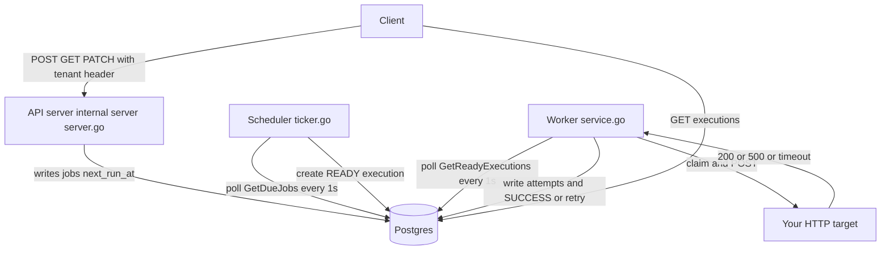
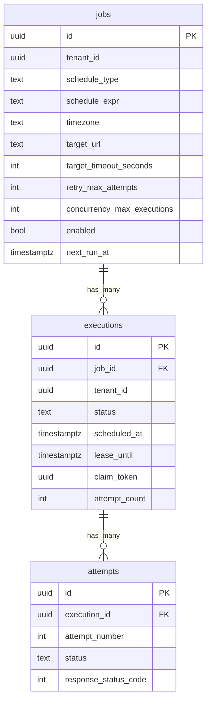
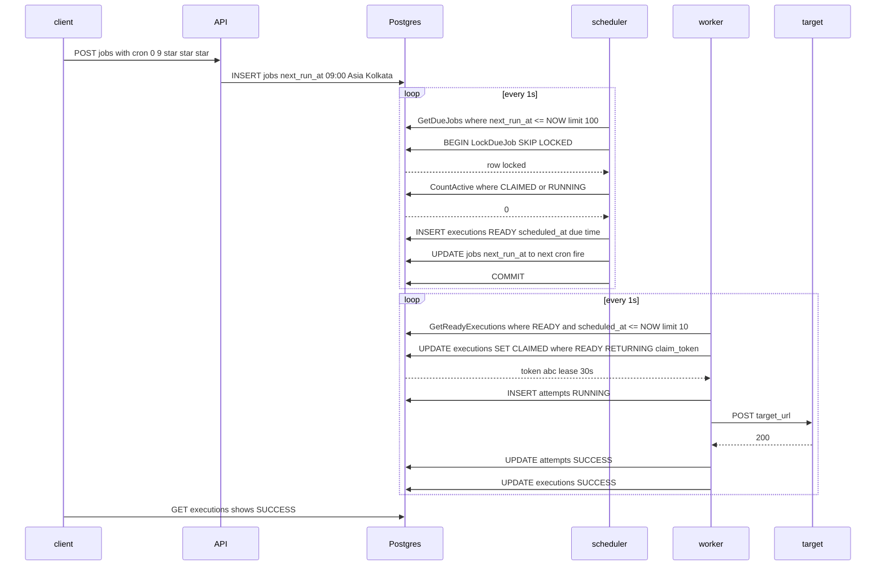
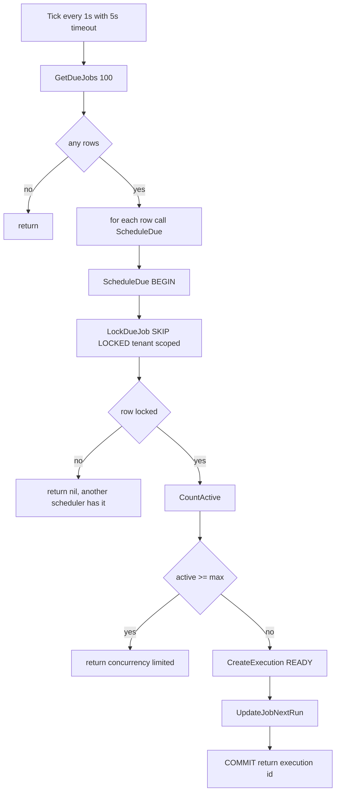
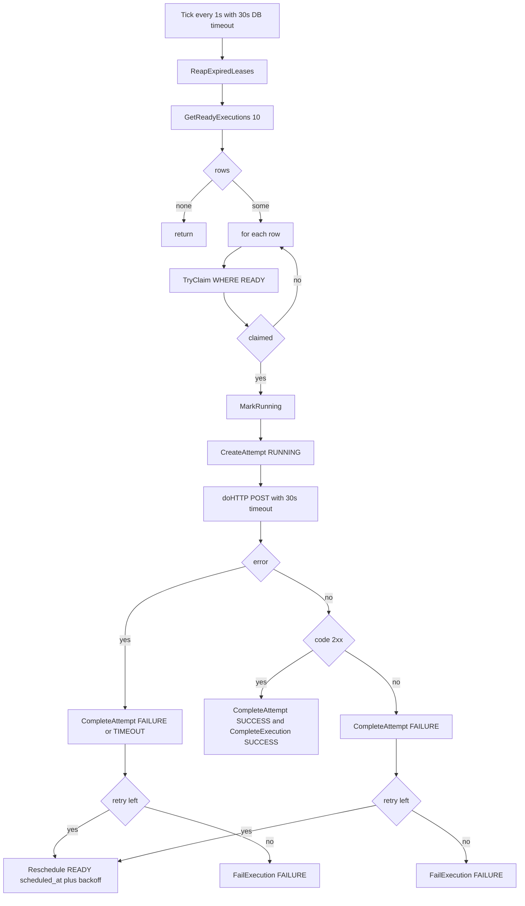
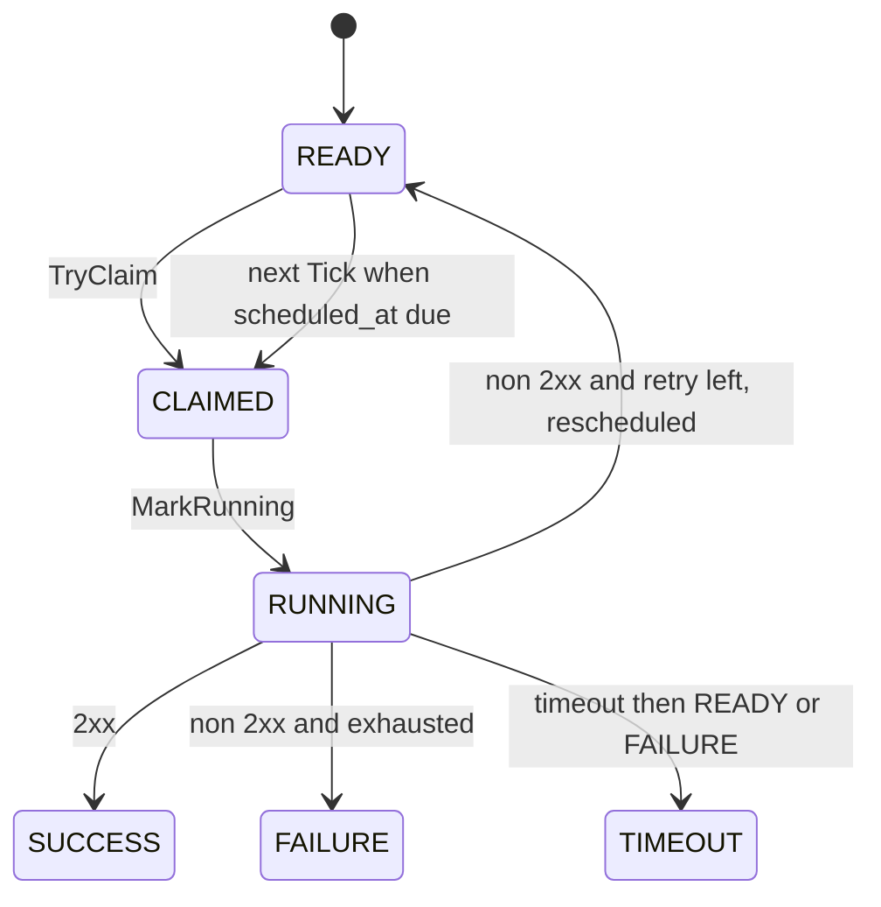
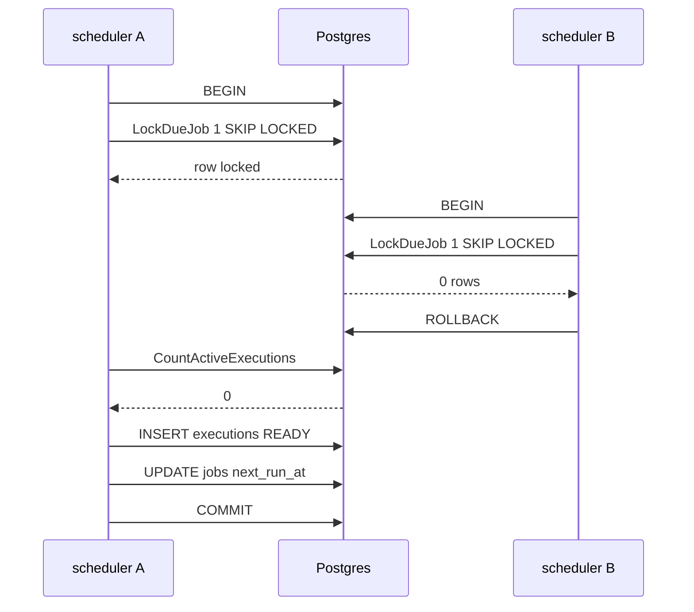
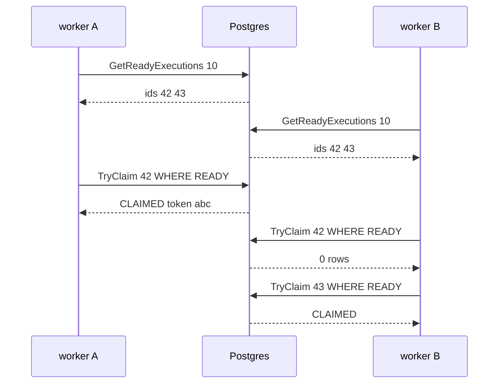

# Cronio: building a distributed scheduler where Postgres is the lock

Cronio is a distributed job scheduler. You create a job, say when it fires, and see what happened. No crontabs on app servers. One API, one table, schedulers and workers that scale separately. This article explains how it is built, where the races are, and how Postgres decides them. The code lives at `github.com/Ayush27pandit/Cronio` and the module root is `server/`.

## Why another scheduler

Most teams start with a cron line on one server. It works until the server dies, the job is slow, or no one knows if it ran. Cronio moves that responsibility out of the app.

* If the server that owns cron dies, another scheduler picks up the job within a second.
* One slow job does not block others, per-job concurrency is checked inside the same transaction.
* Every firing keeps a row, so you can ask what happened without tailing logs.

Cronio does not try to be a queue for everything. It does time triggered HTTP work and it does it with at-least-once delivery. Your target handles dedupe by storing the execution id.

## Stack and layout

* Go 1.22+, Postgres 15+ with `pgcrypto`, `chi/v5`, `jackc/pgx/v5/stdlib`, `sqlc`, `golang-migrate`, `robfig/cron/v3` 5-field only
* Module root is `server/` `server/go.mod:1`, not repo root. All `go` commands run from `server/`
* Entrypoint `server/cmd/api/main.go:22` loads `server/.env` via `godotenv`, connects with `database.New`, runs migrations on a throwaway connection, then starts `server.New` plus `scheduler.NewTicker` and `worker.New` in the same binary for MVP
* Deep module `server/internal/job/` owns the Job seam, `server/internal/scheduler/ticker.go` owns the poll, `server/internal/worker/service.go` owns claim and execute
* Generated code in `server/internal/database/generated/` is committed, do not hand edit it, run `sqlc generate` after editing `queries/*.sql`

```bash
go vet ./...    # must pass
go test ./...   # job tests in-process, scheduler and worker need DB_URL
go run ./cmd/api
```

## Domain language

The code uses the same words as `CONTEXT.md:1`. This matters because the schema and the API use these names verbatim.

* Tenant is the isolation boundary, a UUID you send as `X-Tenant-ID`
* Job is the definition, name plus schedule plus target
* Schedule is Cron, Interval, or Once
* Target is an HTTP endpoint for MVP, url plus method plus headers plus timeout
* Execution is one firing, tracked from READY to terminal
* Attempt is one try inside an execution
* Lease is claim_token plus lease_until, a worker holds it
* Retry policy is max attempts and initial and max delay, exponential backoff
* Concurrency policy is how many executions of the same job may be CLAIMED or RUNNING

If you keep these words, the DB columns read like spec.

## System overview

All three services talk to the same Postgres. For MVP they run together, later they split with no code change beyond wiring.



Control plane is API, scheduler, worker. Data plane is Postgres and your targets. The queue is Postgres, not NATS, for MVP.

## What Postgres stores

From `server/internal/database/migrations/001_create_jobs.up.sql:1`, `002_create_executions.up.sql:1`, `003_create_attempts.up.sql:1`:



`jobs.next_run_at` is the only scheduler cursor, indexed `idx_jobs_next_run where enabled` `001_create_jobs.up.sql:42`. `executions.scheduled_at` is the only worker cursor, indexed `idx_executions_ready where READY`. `lease_until` has `idx_executions_lease where CLAIMED or RUNNING`.

## The deep Job seam

`server/internal/job/` is small on the surface and large behind it. This is intentional. Callers learn three constructors and a few methods.

`schedule.go:1` defines `Schedule` as a value. You build it with `NewCronSchedule`, `NewIntervalSchedule`, `NewOnceSchedule`. Validation happens there, not on every tick. `NextRun` is pure and returns UTC. Cron is 5-field `MIN HOUR DOM MONTH DOW` via `time.LoadLocation`, interval is `time.ParseDuration` greater than zero, once is `time.RFC3339` and disables if past.

`tenant.go:1` defines `TenantID` as a distinct type so the compiler catches swapped args. Handlers pass `TenantID` explicitly and queries check `where tenant_id = $2`.

`service.go:1` has `ScheduleDue`. One transaction: `LockDueJob FOR UPDATE SKIP LOCKED` tenant scoped, `CountActiveExecutions` for `concurrency_max_executions`, rebuild typed `Schedule`, compute `NextRun` after the due time, `CreateExecution` with `scheduled_at` equal to the due time, `UpdateJobNextRun` with `enabled false` for finished Once. Fleet safe.

`store.go:1` has `Create`, `Get`, `List`, `Update`, `ListExecutions`. It validates name and target url, computes `next_run_at` from `Schedule.NextRun`, and hides `sql.NullTime`.

The old shallow cluster `internal/scheduler`, `internal/database/repository`, `internal/jobs` was deleted in `66a1ec6`. It pushed bugs to callers. Locality is better now.

## How a job fires

A single due job, from create to success, touches Postgres four times.



If the target returns 500 or times out, worker writes `FAILURE` or `TIMEOUT` and either reschedules the same execution to `READY` with `scheduled_at = NOW() + backoff` or marks `FAILURE` terminal when `attempt_count >= retry_max_attempts`. No new execution row is created for retries.

## Scheduler in detail

`server/internal/scheduler/ticker.go:15` is thin. `Tick` is the test surface, `Start` is the loop.



Tests hit `Tick` directly with a real Neon DB when `DB_URL` is set `ticker_test.go:33`. Vet must stay green.

## Worker in detail

`server/internal/worker/service.go:15`, `http.go:1`, `backoff.go:1`. Worker polls `GetReadyExecutions` `server/internal/database/queries/worker.sql:1` where `READY` and `scheduled_at <= NOW()` ordered by `scheduled_at`.



`doHTTP` validates the url, blocks `169.254.169.254` and `metadata.google.internal` `http.go:1`, respects `target_timeout_seconds` default 30, limits body to 1MB.

`NextDelay` `backoff.go:6` is pure: attempt 1 is `initial`, then times two each try, capped at `max`. Default initial 60 and max 3600, so delays are 60, 120, 240.



Integration tests in `service_test.go:33` use `httptest.NewServer` for 200 and 500, and push other READY to `NOW() + 1 day` for isolation.

## Concurrency and races, the part Postgres decides

Every race is a `WHERE` clause.

### Scheduler race

Two schedulers see the same due job. Only one gets the row.



Tenant isolation is in the lock `WHERE id = $1 and tenant_id = $2` `scheduler.sql:2`. A wrong tenant gets 0 rows.

Per-job concurrency is inside the same transaction. If `active >= concurrency_max_executions` `service.go:77`, `ScheduleDue` returns `ErrConcurrencyLimited` and the scheduler logs `schedule due failed` and skips. No new READY is created until a worker finishes and `CountActive` drops.

### Worker race

Workers do not hold a row lock for seconds. They use an atomic `UPDATE WHERE status = READY`.



Stale reads from `GetReadyExecutions` are harmless, the claim decides. `claim_token` is `uuid.NullUUID` and `lease_until` is `NOW() + 30 seconds` `worker.sql:21`. `ReapExpiredLeases` runs at the start of every Tick and resets any `CLAIMED` or `RUNNING` where `lease_until < NOW()` to `READY` `worker.sql:103`. Kill a worker holding `CLAIMED`, another picks it up after 30s.

No heartbeat yet for MVP. The 30s lease covers `doHTTP` timeout 30. Long jobs will need heartbeat renewal later.

### Why the split matters

Scheduler holds the row for under 1ms, then releases. Worker holds the lease for seconds. They use separate transactions, both `SKIP LOCKED`. You can run one API, two schedulers, two workers in one binary for MVP `cmd/api/main.go:72`, or split to `cmd/scheduler` and `cmd/worker` later with the same pools. No leader election.

## Failure modes

* Scheduler down 2 minutes: `jobs.next_run_at` stays past, when it returns it creates one READY per overdue job, not per missed tick, because it does `NextRun` after the due time once per `ScheduleDue`.
* Worker down holding `CLAIMED`: reaped to `READY`, retried, `attempts` keeps the gap.
* Target 500 three times: three attempts `FAILURE`, execution `FAILURE` terminal, delays 60, 120, then done. Job stays enabled.
* Timeout: `doHTTP` returns `context deadline exceeded`, attempt `TIMEOUT`, same retry, `result_error` holds the text.
* SSRF: `validateTargetURL` `store.go:302` blocks `169.254.169.254`.
* DB down: `Tick` logs `poll failed` and returns, next tick retries. Health `GET /health` stays 200 even if DB is down, it does not ping.

## Scaling and observability

Current indexes are partial and small: `idx_jobs_next_run where enabled`, `idx_executions_ready where READY`, `idx_executions_lease where CLAIMED or RUNNING`. The scheduler query uses the first, the worker poll uses the second.

For MVP logs are `slog` JSON. Next steps are Prometheus `scheduler_claimed_total` and lease expiry metrics, plus a `leases` table separate from `executions` when we need per-tenant and per-worker concurrency.

## Testing

```
go vet ./...
go test ./...                 # job in-process, scheduler and worker need DB_URL
DB_URL=... go test ./internal/worker -run TestWorker_Tick -v
sqlc generate                 # after queries or migrations
```

Worker tests need `DB_URL` and use `httptest` and the push-to-future isolation trick. Scheduler ticker tests use the same pattern.

## What is not built yet

`GET /v1/executions by id`, `DELETE` soft disable, `target.timeout` and `retry` and `concurrency` fields exposed in the API JSON, pagination, API keys, `cmd/scheduler` and `cmd/worker` binaries, NATS, dispatcher, Next.js `web/` UI.

When those land, the deep seams stay: add the field to typed `Schedule` or `CreateInput` first, then to `queries/job.sql` and `sqlc generate`, then to the handler. Keep history clean, one commit per phase, `go vet` green.

## Try it

```bash
TENANT=11111111-1111-1111-1111-111111111111
curl -X POST http://localhost:8080/v1/jobs -H "X-Tenant-ID: $TENANT" -H "Content-Type: application/json" -d '{"name":"daily report","schedule":{"type":"cron","expression":"0 9 * * *","timezone":"Asia/Kolkata"},"target":{"url":"https://httpbin.org/post"}}'
curl -H "X-Tenant-ID: $TENANT" http://localhost:8080/v1/jobs
curl -H "X-Tenant-ID: $TENANT" http://localhost:8080/v1/jobs/id/executions
```

The static UI at `http://localhost:8080/` shows jobs and recent executions without a build step.

Cronio does a small thing and does it with a lock. If you need time as an execution layer, it is there.
